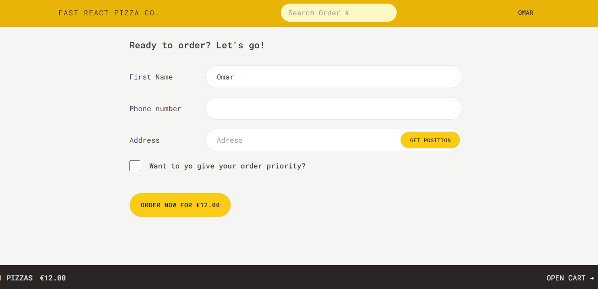

# Project Title: Fast React Pizza Co.

## Description

- ### **Short:** App For Ordering Pizza Online

- ### Starting Page

  - The App Starts with a welcome page with a username field to use it in ordering

- ### Pizza List Page

  - A Page rendering all the pizza from an API with all information need to make a decision

- ### Create New Order Page

  - With a form for creating new order and take aditional information from the user like phone number and address with form validation

- ### Order Status Page

  - The User can easily track his order status including delivery time and other info

- ### Cart Page

  - The cart page track/control user choosed pizzas making a step into ordering

## Installation

- To run on your machine, after downloading the project run these two commands in the terminal or check the live demo below

  -1

  ```bash
    npm install
  ```

  -2

  ```bash
    npm run dev
  ```

## Development Tools

- #### Programming Languages

  - &nbsp;
    &nbsp;
    &nbsp;

- #### Used Technologies

  
  
  
  

  
  &nbsp;
  &nbsp;
  &nbsp;

- #### Patterns & Used Techniques

  - Fake Authentication & Authorization
  - Reusability
  - New React Router
  - Responsive Design
  - Form Error Handling
  - Routing Error Handling

## New Tools Aquired

- 
  
  

## Demo & Screeen Shoots

- ## [**Live Demo**](https://my-fast-react-pizza-co.vercel.app/)

<hr />

- 

- 

- 

- 

- 
